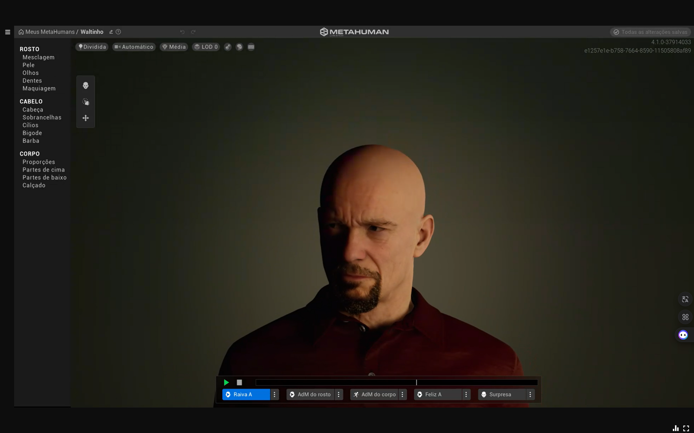

# Introdução

Na seção de Animações, buscamos explorar o processo de animação de personagens, focando principalmente na animação de fala e gesticulação. Embora o objetivo central do projeto não seja exclusivamente a animação facial, começar com algo mais comum e acessível, como a animação de fala, facilita a adaptação ao processo e contribui para uma maior familiaridade com a ferramenta e as técnicas utilizadas. O uso de animações simples, como as de fala, serve como um ponto de partida para projetos mais complexos, onde a integração de movimentos corporais e ambientes virtuais será cada vez mais desafiadora e interessante. Nesta seção, apresentamos desde a criação do personagem até a implementação de animações complexas utilizando o Unreal Engine, incluindo a integração de IA para gerar e sincronizar a fala.

## 1. Criação do personagem

Para criar um vínculo mais forte com o nosso personagem e ter controle total sobre seu design, decidimos criar um do zero, seguindo as características que julgamos mais apropriadas para nossos testes. A ferramenta Metahuman Creator, da Unreal Engine, foi utilizada para a criação do personagem. Após a modelagem, o personagem foi exportado para ser utilizado em animações faciais e gestuais.

Imagem do personagem.

## 2. Criação da cena

A criação da cena foi realizada no Unreal Engine 5.5, onde configuramos o ambiente e o humano virtual para a demonstração das animações. Durante esse processo, seguimos tutoriais detalhados de especialistas como MR GFX Unreal, que nos guiaram na implementação da animação facial sincronizada com áudio gerado por IA.

### 2.1 Demonstração da animação da fala

Nesta etapa, sincronizamos a fala do personagem com a animação facial usando áudio gerado por IA. A ferramenta do Unreal Engine 5.5 permitiu criar movimentos labiais e expressões faciais realistas, como movimentação dos lábios, olhos e sobrancelhas, de forma automática. A animação foi ajustada para que a fala fosse visualmente expressiva e bem sincronizada com o áudio, sem a necessidade de captura de movimento.

[Demonstração da animação da fala](https://github.com/user-attachments/assets/eac8a264-e69b-4451-b9dd-a5258983b677)

### 2.2 Demonstração da implementação da animação de fala no personagem

Aqui, a animação facial foi aplicada ao personagem 3D, utilizando o Unreal Engine 5.5 e Blueprints para sincronizar a fala com os movimentos faciais. A animação foi integrada ao personagem, garantindo uma expressão realista durante a fala, e ajustada para criar uma interação mais natural e convincente no cenário virtual.

[Demonstração da animação da fala no personagem](https://github.com/user-attachments/assets/211e1355-d697-41ee-9480-a22b9b999c8c)

## 3. Implementação de animação corporal e cenário

Com a animação facial em funcionamento, o próximo passo foi a implementação de movimentos corporais e a integração de um cenário virtual. Utilizando o Unreal Engine 5.5, conseguimos criar um ambiente interativo, no qual o personagem não apenas falava, mas também se movimentava de acordo com a animação definida, criando uma experiência mais imersiva.

[Demonstração da implementação de animação corporal e cenário de laboratório](https://github.com/user-attachments/assets/88fd4dd9-de19-4302-83aa-f61639cd67d0)

### 3.1 Testagem do modo câmera para definição do enquadramento e gravação

Antes de finalizar o processo de gravação e renderização, realizamos uma série de testes no modo câmera do Unreal Engine para ajustar o enquadramento e garantir que os movimentos do personagem e os efeitos visuais estivessem perfeitamente sincronizados.

[Testagem do modo câmera para definição do enquadramento e gravação](https://github.com/user-attachments/assets/d6f430c1-3150-491d-9c44-31540e50790f)

## 4. Referência e créditos

- Meta Human Creator by Unreal Engine - [https://metahuman.unrealengine.com](https://metahuman.unrealengine.com/)
- Voice Generation and Cloning by Eleven Labs - [https://elevenlabs.io/](https://elevenlabs.io/)
- Chemistry Lab Classroom by [styloo](https://www.fab.com/sellers/styloo) [https://fab.com/s/24083491ee1f](https://fab.com/s/24083491ee1f)
- MC Sample Pack by [MoCap Central](https://www.fab.com/sellers/MoCap%20Central) - [https://fab.com/s/71059470c6ce](https://fab.com/s/71059470c6ce)
- “audio to face Metahuman unreal engine 5.5 | Animate face from your voice” by [MR GFX Unreal](https://www.youtube.com/@MR_GFX) -  https://www.youtube.com/watch?v=ld5gwpR72R8
- “Easy way To Add Any Animation To Metahumans | MetaHuman animation library” by  [MR GFX Unreal](https://www.youtube.com/@MR_GFX) -  https://www.youtube.com/watch?v=bV1mquFImGQ
