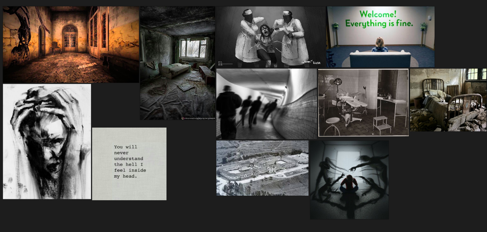
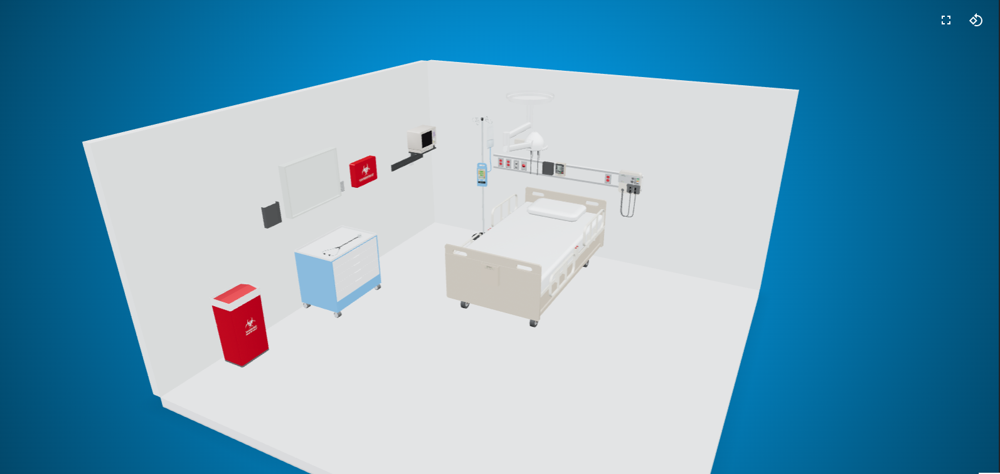
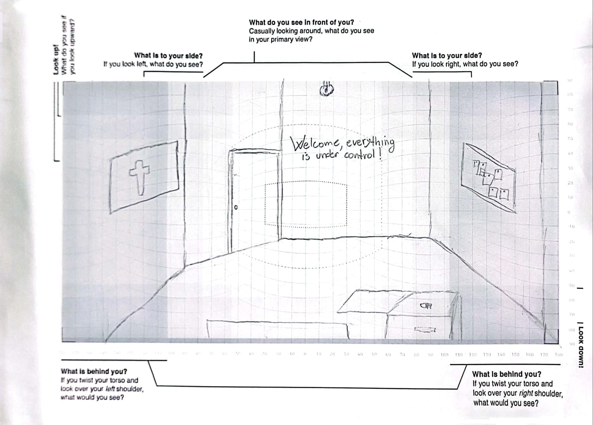
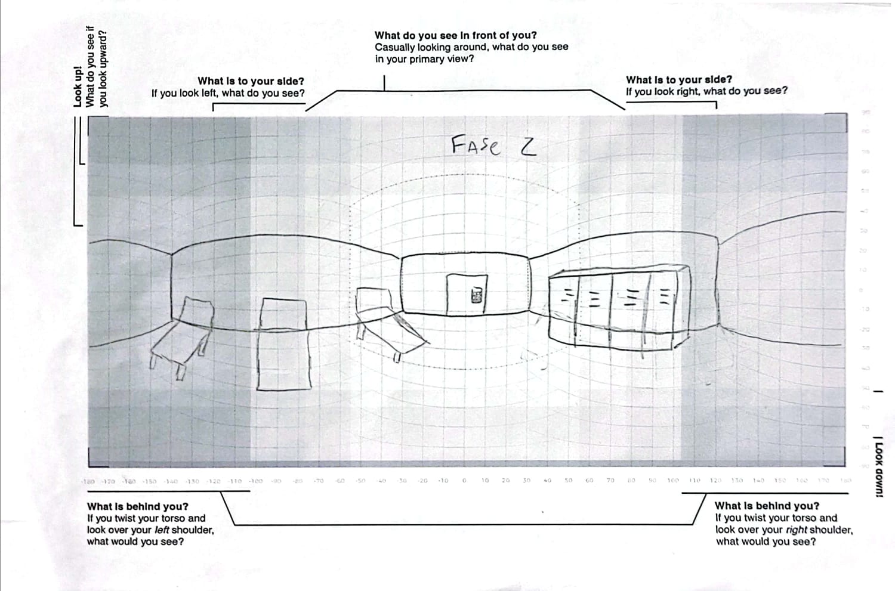
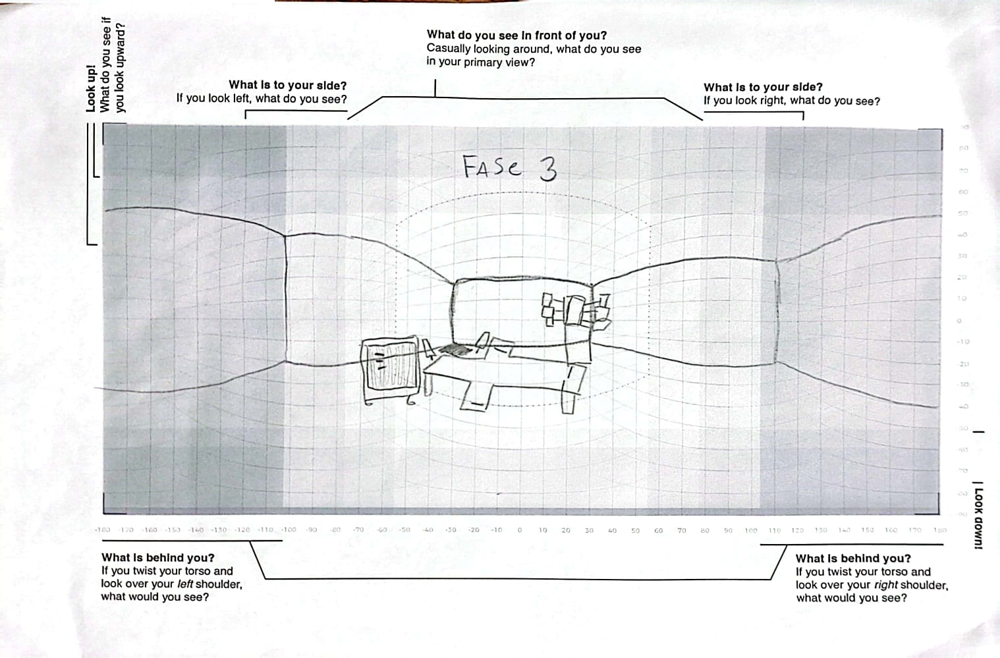

# Análise técnica  

## Painel de referências do projeto
O painel de referências do projeto foi criado no software PureRef. Procuramos referências de coisas que remetessem a hospitais psiquiátricos, saúde mental (ou a falta dela), terror, abandono de ambientes físicos e de pessoas. Foi considerado e visto pelo grupo o documentário [Holocausto Brasileiro](https://www.youtube.com/watch?v=jIentTu8nc4), que relata os horrores vividos por uma comunidade de pessoas que ficaram presas e pacientes no hospital Colônia em Barbacena, MG. Além do documentário, a série The Good Place, disponível na Netflix, que aborda temas relacionados entre filosofia e ética, também foi levada em consideração.



## Narrativa
Foi desenvolvida uma arquitetura inicial da narrativa. Ela está disponível no formato .twee e html dentro da pasta assets deste projeto. O objetivo foi compreender a história do quarto inicial do jogo. 

```
Quarto inicial
Personagem acorda sentado:
Ele olha o ambiente. 

Narrador: Acorda! Aproveita que eles acabaram de sair.
Narrador: Não temos muito tempo. Eles devem chegar em 10 minutos.

[[Remédio]]
[[Ler as infos do quadro]]
[[Olhar de trás da cruz]]
```

## Seleção de assets
Os assets selecionados podem ser vistos nesse <a href="https://docs.google.com/document/d/1HDZwpEH3jQ00SaCqW1qbGwzW8cKv6jx84AfXTafQsRs/edit?tab=t.0">link</a>. Nessa lista inclui vários itens hospitalares e itens em um geral, como:
* Cama 
* Remédios
* Cigarro eletrônico
* Porta
* Hera
* Janela
* Lixo 



## Wireframes (VR)

O wireframe é um esboço inicial que define o layout e a disposição dos principais elementos do ambiente em um jogo de Escape Room em VR. Neste caso, procuramos desenvonvler o modelo baseado no jogo que é ambientado em um hospício de terror, onde o jogador deve resolver puzzles para escapar de quartos antes que o tempo acabe e o enfermeiro retorne. Cada nível (quarto) apresenta desafios crescentes, com elementos interativos cuidadosamente posicionados para proporcionar uma experiência imersiva e desafiadora.

---

### **Nível 1: Quarto Inicial**
Este nível apresenta o jogador ao jogo com um ambiente simples e elementos básicos que introduzem a mecânica de puzzles.



- **Elementos do Quarto:**
  - **Porta:** Localizada no centro à esquerda do jogador, é a saída do quarto. Está trancada e requer a resolução do puzzle para ser aberta.
  - **Cama:** O jogador começa sentado ou próximo à cama, criando uma sensação de despertar no ambiente.
  - **Quadro de Informações:** Um quadro posicionado na parede oposta à cama, exibindo dicas e informações iniciais para ajudar o jogador.
  - **Mesinha com Remédios:** Próxima à cama, há uma mesinha com frascos de remédios que podem ser investigados pelo jogador.
  - **Mensagem:** No centro do quarto, uma frase intrigante – *"Welcome, everything is fine"* – está escrita na parede, criando um contraste curioso com o cenário.
  - **Quadro com Puzzle:** Um quadro na parede que contém o puzzle necessário para desbloquear a porta.

---

### **Nível 2: O Dormitório**
Neste nível, a dificuldade aumenta com mais elementos no ambiente, introduzindo novos tipos de puzzles.



- **Elementos do Quarto:**
  - **Mais Camas:** O quarto é maior e contém várias camas, criando um ambiente mais assombroso e mostrando a realidade do verdadeiro ambiente.
  - **Armário:** Localizado no canto direito, contém um puzzle que deve ser resolvido para acessar pistas ou itens essenciais.
  - **Porta com Tranca Eletrônica:** Localizada no centro da parede oposta, essa porta é o objetivo principal do nível. A tranca requer códigos ou interação com outros elementos para ser aberta.

---

### **Nível 3: A Sala de Tortura**
O nível final intensifica o terror e a pressão, exigindo mais raciocínio lógico e coragem.



- **Elementos do Quarto:**
  - **Maca de Tortura:** No centro do quarto, uma maca em formato de cruz desgastada com manchas e detalhes sombrios aumenta a tensão do ambiente.
  - **Cofre:** Posicionado ao lado da maca, contém uma seringa, essencial para resolver o puzzle final.
  - **Painel de Controle:** No centro do ambiente, um painel eletrônico controla a porta de saída, que está próxima.
  - **Porta:** Localizada ao lado do painel, é o objetivo final do jogador. Para abri-la, é necessário interagir com os itens encontrados no ambiente e resolver o puzzle do painel.

---

### **Justificativa do Layout**
- **Acessibilidade e Intuitividade:** A disposição dos elementos facilita o reconhecimento do objetivo principal em cada nível (a porta) e a exploração gradual dos puzzles.
- **Ambientação e Imersão:** Os elementos foram posicionados para criar uma atmosfera tensa e envolvente, guiando o jogador a explorar cada canto do quarto em busca de pistas.
- **Dificuldade Progressiva:** A transição entre os níveis aumenta a complexidade dos puzzles e a quantidade de elementos interativos, desafiando as habilidades do jogador.

--- 
