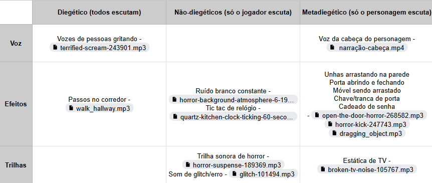

## Introdução ao Sound Design

Na semana 3 do projeto, o grupo explorou o conceito de Sound Design, que desempenha um papel essencial na construção de experiências imersivas. O espaço acústico foi entendido como uma dimensão contínua, simultânea, multidirecional, dinâmica, envolvente e integrada, elementos que contribuem para a narrativa sonora de qualquer projeto.

## Conceitos Fundamentais

Três pilares principais orientaram o desenho de sound design neste projeto: voz, efeitos e trilha sonora. Durante o desenvolvimento, analisamos como esses elementos interagem com a diegese do projeto.

- Diegético: Sons que fazem parte do mundo da narrativa, percebidos por todos os personagens na cena (ex.: passos, diálogos).
- Não diegético: Sons que estão fora do mundo narrativo, audíveis apenas ao público (ex.: trilhas sonoras ou narrações externas).
- Metadiegético: Sons percebidos apenas por um personagem específico, representando sua perspectiva interna ou emocional (ex.: batimentos cardíacos acelerados).

Essa classificação foi fundamental para definir quais sons deveriam ser integrados à narrativa e como cada um deles contribui para a experiência do jogador, gerando uma planilha disponível [aqui](https://docs.google.com/spreadsheets/d/1QPD5l31eci6s8OAlTdOwfUl_XQfDxMeQgMGIqMOfsLY/edit?usp=sharing).

## Seleção de Assets Sonoros

Na busca por assets sonoros, foram utilizados os bancos de áudio Pixabay e YouTube. A curadoria resultou em uma lista de recursos disponíveis neste [link](https://drive.google.com/drive/u/1/folders/1_qfeGYAMTHKGjGqFtkuGoP6lP-rKHsCp).

Os sons selecionados incluem uma ampla variedade de estímulos, desde barulhos desconfortáveis (unhas arranhando superfícies, zunidos de mosquitos) até gritos, sons ambientes e barulhos de relógios. Essa diversidade visa garantir que cada som seja estrategicamente posicionado para enriquecer a narrativa e intensificar as emoções do público. Essa primeira curadoria é uma versão inicial. Após a nova versão do level design, alguns sons devem ser removidos e adicionados.

Finalizando, a narração da voz da cabeça do personagem, uma das mecânicas core do jogo, já começou a ser desenvolvida. A seguir, é possível ouvir o primeiro minuto do player no jogo.

<iframe 
  width="560" 
  height="315" 
  src="https://www.youtube.com/embed/pN36BC7-TPY" 
  title="YouTube video player" 
  frameborder="0" 
  allow="accelerometer; autoplay; clipboard-write; encrypted-media; gyroscope; picture-in-picture" 
  allowfullscreen>
</iframe>