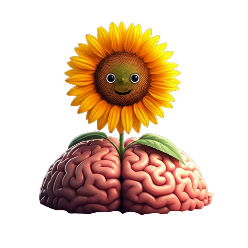
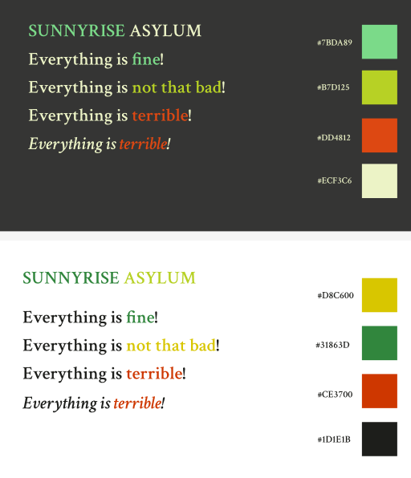

## Identidade visual

O hospital é um lugar sombrio e sujo, onde a experiência de estar no quarto transmite sentimentos de abandono, solidão e medo do desconhecido. Apesar disso, a identidade visual do hospital é cuidadosamente projetada para ser atraente, quase como se quisesse convencer as pessoas de que se trata de um lugar acolhedor para se hospedar.

Com base nessa dualidade, foi desenvolvido o logo do hospital que, por extensão, também é o logo do nosso jogo, Escape Sunnyrise.

O logo faz uma alusão a uma lobotomia, procedimento cirúrgico que foi um procedimento neurológico amplamente utilizado no século XX para tratar transtornos mentais graves, como esquizofrenia, depressão severa e ansiedade. O procedimento consistia em cortar ou danificar as conexões entre os lobos frontais do cérebro e outras áreas, como o tálamo, na tentativa de aliviar sintomas psicológicos intensos.

Nesse contexto, o girassol no logo se assemelha a um quebrador de gelo, instrumento amplamente utilizado para cirurgias desse tipo. O semblante do girassol é ambíguo — ele não parece totalmente amigável, provocando um misto de curiosidade e inquietação em quem o observa.

## Cores e tipografia

As cores foram escolhidas para se adaptar a dois contextos distintos: modo escuro (dark) e modo claro (light). Para ambientes mais escuros, como as paredes do quarto, utilizamos a paleta de cores #7BDA89, #B7D125, #DD4812 e #ECF3C6. Já para ambientes mais iluminados, como as páginas de um livro, as cores escolhidas foram #D8C600, #31863D, #CE3700 e #1D1E1B.

A tipografia selecionada foi a Crimson Text, utilizada em suas variações regular ou semibold, podendo também estar em itálico dependendo do contexto. Essa fonte foi escolhida por transmitir uma sensação de firmeza e opressão, características que remetem à atmosfera do hospital.

## Vertical Slice

Para este primeiro momento, foi desenvolvido um Vertical Slice que já inclui funcionalidades iniciais, como um contador de 10 minutos e a interação com objetos, permitindo pegar um papel e colocá-lo em outro lugar.

<iframe 
  width="560" 
  height="315" 
  src="https://www.youtube.com/embed/moU2e-pC34c" 
  title="YouTube video player" 
  frameborder="0" 
  allow="accelerometer; autoplay; clipboard-write; encrypted-media; gyroscope; picture-in-picture" 
  allowfullscreen>
</iframe>
