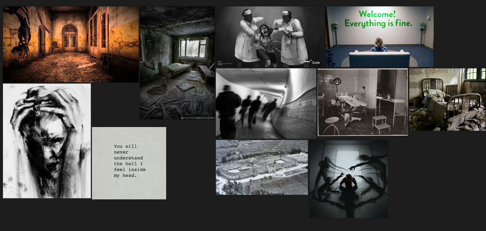

# Análise técnica  

## Painel de referências do projeto
O painel de referências do projeto foi criado no software PureRef. Procuramos referências de coisas que remetessem a hospitais psiquiátricos, saúde mental (ou a falta dela), terror, abandono de ambientes físicos e de pessoas. Foi considerado e visto pelo grupo o documentário [Holocausto Brasileiro](https://www.youtube.com/watch?v=jIentTu8nc4), que relata os horrores vividos por uma comunidade de pessoas que ficaram presas e pacientes no hospital Colônia em Barbacena, MG. Além do documentário, a série The Good Place, disponível na Netflix, que aborda temas relacionados entre filosofia e ética, também foi levada em consideração.



## Narrativa
Foi desenvolvida uma arquitetura inicial da narrativa. Ela está disponível no formato .twee e html dentro da pasta assets deste projeto. O objetivo foi compreender a história do quarto inicial do jogo. 

```
Quarto inicial
Personagem acorda sentado:
Ele olha o ambiente. 

Narrador: Acorda! Aproveita que eles acabaram de sair.
Narrador: Não temos muito tempo. Eles devem chegar em 10 minutos.

[[Remédio]]
[[Ler as infos do quadro]]
[[Olhar de trás da cruz]]
```

## Seleção de assets
Os assets selecionados podem ser vistos nesse <a href="https://docs.google.com/document/d/1HDZwpEH3jQ00SaCqW1qbGwzW8cKv6jx84AfXTafQsRs/edit?tab=t.0">link</a>. Nessa lista inclui vários itens hospitalares e itens em um geral, como:
* Cama 
* Remédios
* Cigarro eletrônico
* Porta
* Hera
* Janela
* Lixo 


